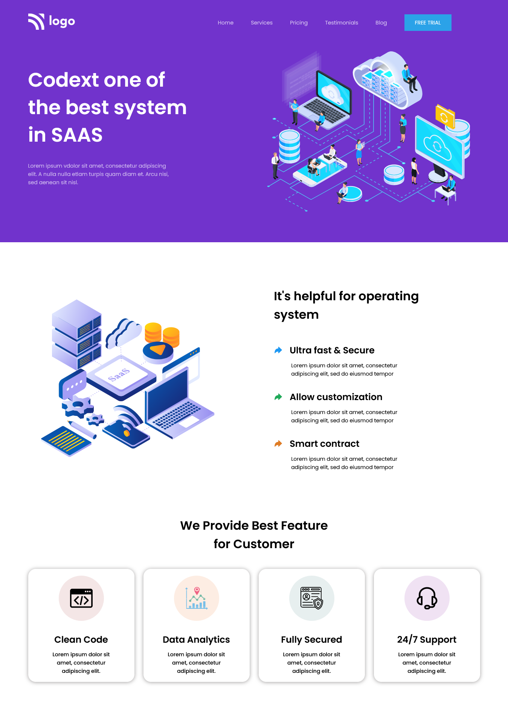

#  ABOUT

## SAAS landing page

## 🔗Demo Link
https://samhith13.netlify.app/

Built this **Responsive** landing Page just by using pure HTML and CSS. 
 

 

## 📌 Tech Stack

&nbsp;
&nbsp;
 
 

##  What I Learn

  👉 **grids**   
  👉 Units like pixels, viewports,percentage   
  👉 **handeling SVG imgaes**  
  👉 **learnt typography**  
  👉 **build a responsive website without flex box or grid**  
  👉 Less HTML and CSS with beautiful **UI Template**  

## Time taken to complete this project was less than **1 hr**.
 

##  Overview

 

 "Template Screenshot")